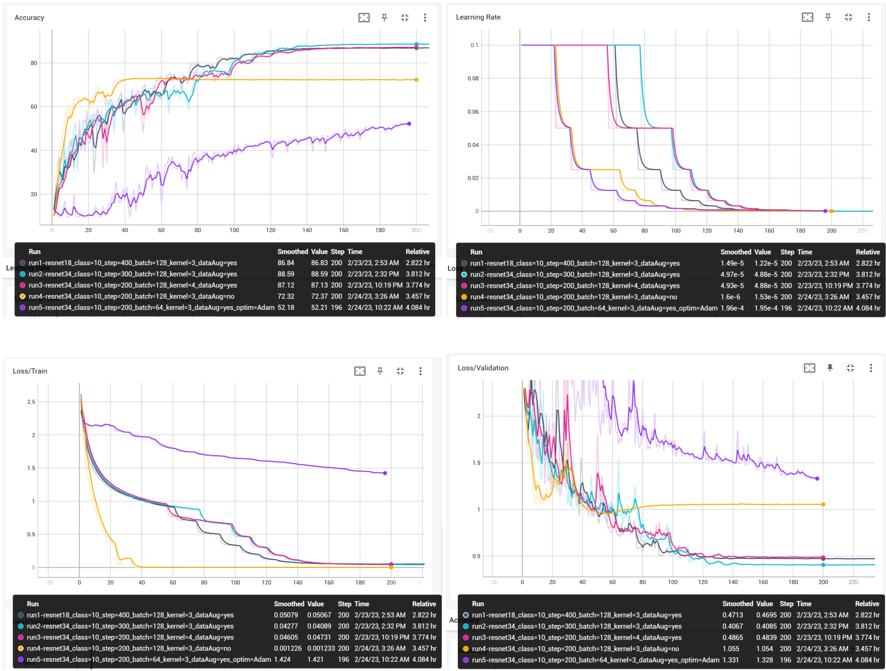
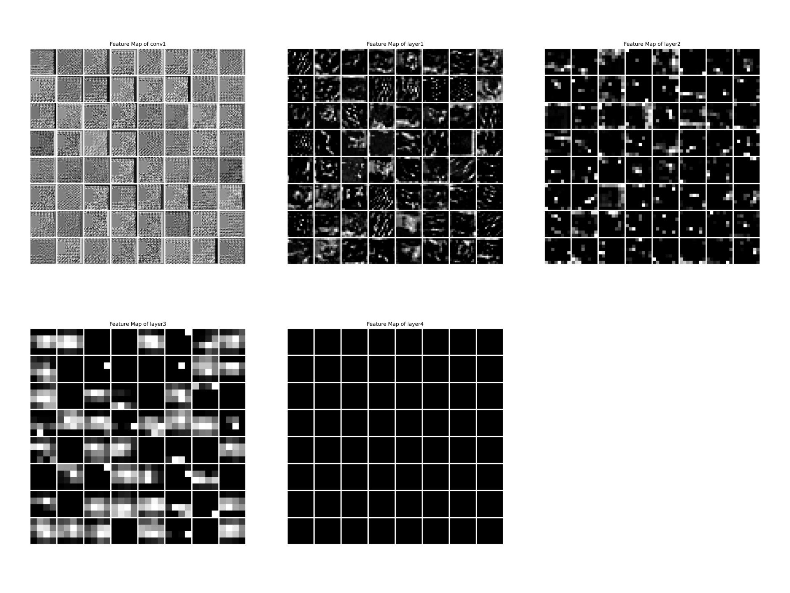
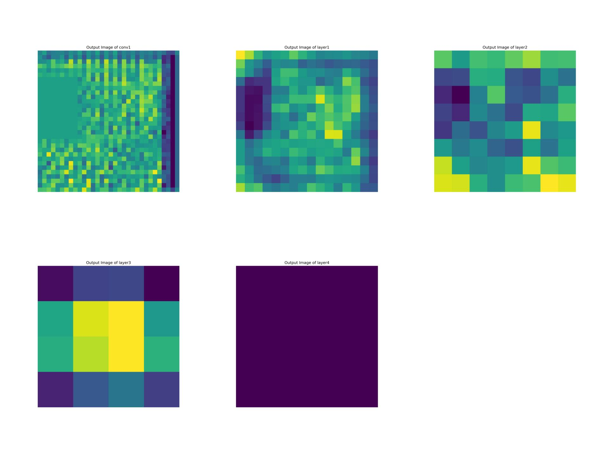

# Train ResNet18/34/50 on Encrypted CIFAR10/100 with Pytorch
This is a modified variant of ResNet trained on encrypted CIFAR10/100 dataset using pytorch. Trying to apply different tricks on modified ResNet to get better performance with encrypted dataset.

Features:
- Modified ResNet architecture to fit CIFAR dataset.
-  Added visualization tool to get feature maps of layers.

## Results
### Train Result


### Feature Map


### Layer Output


## Get Started
### Environment
Make sure you have Nvidia GPU and installed CUDA and CUDNN.
```
cd ResNetToy
pip install -r requirements.txt
mkdir checkpoint dataset runs
```
Structure of `dataset` should be like:
```
└─dataset
    └─10
        │  test_label.txt
        │  train_label.txt
        │
        ├─test
        └─train
```

### Train
Change to your paths in:
```
train.py
utils/readData.py
```
Then run:
```
python train.py
```

### Test
Change to your paths in:
```
test.py
utils/readData.py
```
Then run:
```
python test.py
```

### Visualization
Change to your paths in:
```
vis_tool.py
```
Then run:
```
python vis_tool.py
```
