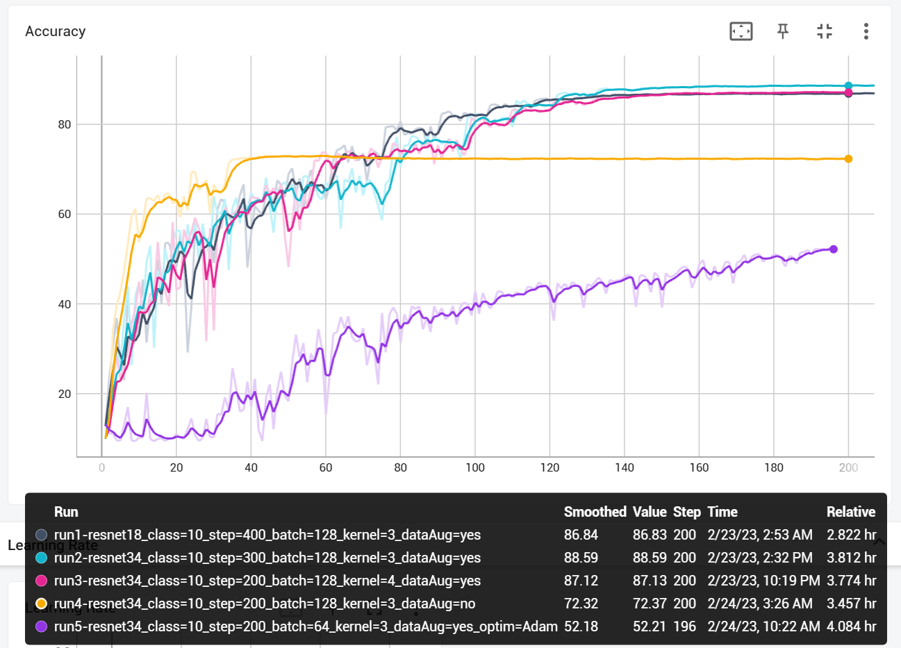

# Train ResNet18/34/50 on Encrypted CIFAR10/100 with Pytorch
This is a modified variant of ResNet trained on encrypted CIFAR10/100 dataset using pytorch. Trying to apply different tricks on modified ResNet to get better performance with encrypted dataset.

## Results


## Get Started
### Environment
Make sure you have Nvidia GPU and installed CUDA and CUDNN.
```
cd ResNetToy
pip install -r requirements.txt
mkdir checkpoint dataset runs
```
Structure of `dataset` should be like:
```
└─dataset
    └─10
        │  test_label.txt
        │  train_label.txt
        │
        ├─test
        └─train
```
Change to your paths in:
```
train.py
utils/readData.py
```
### Train
```
python train.py
```
